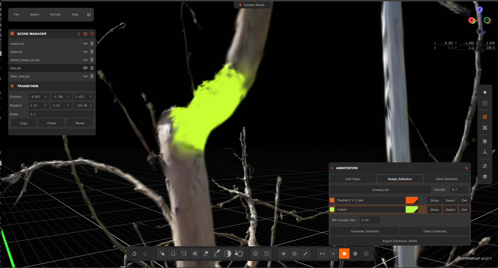
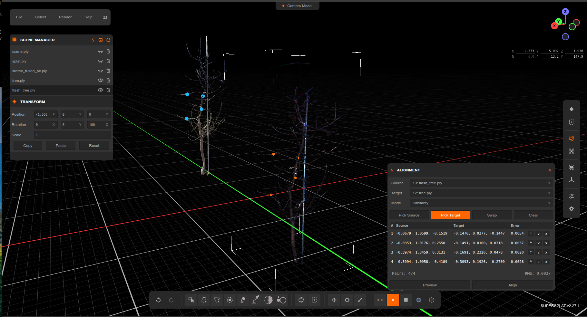

# SuperSplat-Seg

A fork of the [SuperSplat Editor](https://github.com/playcanvas/supersplat) extended with research tools for segmentation, alignment, and Z-up coordinate support — developed at the CMU Kantor Lab.

> **Upstream:** SuperSplat v2.27.0 | Engine v2.18.2 | PCUI v6.1.4

## New Features

### Semantic Labeling (Segmentation)
Assign semantic class labels to individual Gaussians and visualize them with a color overlay.

- Open the **Semantic Labels** panel via the annotation button in the bottom toolbar.
- **Add Class** to create a new label class with an auto-generated color.
- Select Gaussians using any existing selection tool, then click **Assign Selection** to label them with the active class.
- Click a class row to make it active; click **Select** to select all Gaussians with that label.
- Toggle the overlay on/off and adjust opacity with the **Overlay** and **Opacity** controls.
- **Export Centroids JSON** writes a JSON file with per-class centroid positions and splat counts, useful for downstream analysis.

Labels are stored in a per-Gaussian `semantic` channel and are preserved across undo/redo.



### Mesh Import and Per-Vertex Annotation
Import textured 3D meshes (GLB/glTF) from Blender and assign semantic labels to individual vertices — enabling annotation workflows on triangulated geometry alongside Gaussian splats.

- Drag-and-drop a `.glb` or `.gltf` file onto the canvas. The mesh appears with its textures in the scene and is listed in the **Scene** panel alongside any loaded splats.
- Use any selection tool (rect, brush, lasso, polygon, sphere, box) to select vertices on the mesh. Selected vertices highlight in yellow.
- In the **Semantic Labels** panel, click **Assign Selection** to label the selected vertices with the active class. Labeled vertices display the class color tint via a translucent overlay drawn on top of the base texture.
- All selection, labeling, and undo/redo operations work identically to Gaussian splats — class visibility toggles, **Select** by class, and **Export Centroids JSON** clusters labeled vertices and outputs their centroids.
- Transform, rotate, and scale meshes with the same gizmos as splats.

Meshes and splats can coexist in a single scene and share the same semantic class palette. Per-vertex labels are preserved in the project file.

### Splat Alignment
Align two loaded Gaussian splat scenes by picking correspondence point pairs.

- Load two splats and activate the **Align** tool from the bottom toolbar.
- Pick source and target points on each splat to build correspondence pairs.
- Click **Align** to compute and apply an ICP-based rigid transform to the source splat.



### Z-Up Coordinate Mode
Toggle between Y-up (default) and Z-up coordinate systems for data captured in a Z-up frame.

- Enable **Z-Up** in the **View** panel.
- The scene root rotates −90° on X so that data-Z maps to world-Y, keeping the infinite grid and all tools consistent.
- The transform gizmo Y/Z axis colors swap to reflect the active convention.

### Point Cloud Import
`.ply` files containing point cloud data (no Gaussian covariance) can now be imported directly alongside splat files.

### Orbit Animation Generator
Generate a smooth camera orbit as a dense set of keyframes in the timeline — avoiding the "camera dip" artifact that occurs with sparse keyframes on a circular path.

- Open the timeline panel (bottom toolbar) and click the **Orbit** button to expand the orbit parameter panel.
- Set the orbit **center** (X/Y/Z), **distance**, **elevation** (degrees above the horizon), **degrees** (start/end azimuth in degrees), **frame** (start/end frame), and **step** (frames between generated keyframes).
- Click **Generate Orbit** to replace the timeline with the generated keyframes.
- Defaults are auto-filled from the current camera position when the panel is opened.
- Click **Clear** to remove all keyframes and start over.

Both operations are fully undoable with Ctrl+Z.


### Camera Pose Overlay
A compact HUD in the top-right corner, just below the axis gizmo, showing the camera's live position and orientation.

- **X / Y / Z** — camera world position.
- **R / P / Y** — Roll (fixed at 0 for orbit camera), Pitch (elevation), Yaw (azimuth) in degrees.
- All values update in real time as the camera moves.
- Click any editable field and type a new value, then press **Enter** (or click away) to jump the camera to that position or angle precisely.

### Opacity Select
Select Gaussians by opacity value to prune low-opacity splats that are barely visible — reducing file size and improving scene performance.

- Activate the **Opacity Select** tool from the bottom toolbar (to the right of the eyedropper).
- Set a **Threshold** (0–1). Gaussians with a decoded opacity below this value will be targeted.
- Click **Select** to replace the current selection, **Add** to extend it, or **Remove** to subtract from it.

### Size Select
Select Gaussians by size to prune tiny splats that contribute little to the rendered image.

- Activate the **Size Select** tool from the bottom toolbar (to the right of Opacity Select).
- Set a **Threshold**. Gaussians whose size (`scale_x + scale_y + scale_z` after exponentiation) is below this value will be targeted.
- Click **Select** to replace the current selection, **Add** to extend it, or **Remove** to subtract from it.

> Opacity Select and Size Select are adapted from [GaussianSplatEditor](https://github.com/TimChen1383/GaussianSplatEditor) by [@TimChen1383](https://github.com/TimChen1383).

## Patch Notes

### Fix: Y and Z coordinate flip in point selection display and centroid export when Z-Up is enabled

When Z-Up mode was enabled, the point coordinates shown in the bottom-left and the centroid coordinates exported to JSON had Y and Z values flipped. The fix applies the z-up coordinate transformation (display space: X=right, Y=-up, Z=forward) consistently across all coordinate displays and exports:

- [src/ui/editor.ts](src/ui/editor.ts): Apply z-up transformation to the cursor label (bottom-left point coordinates display).
- [src/annotation-io.ts](src/annotation-io.ts): Apply z-up transformation to centroid coordinates only when exporting to JSON, keeping visual centroid markers in world space.
- Centroid markers now display at correct positions when z-up is enabled.

### Fix: splats disappearing at certain camera angles in Z-Up mode

When Z-Up was enabled, the scene's content root was rotated −90° on X but each splat's cached world-space AABB was not refreshed. PlayCanvas's per-mesh-instance frustum culling then read a stale AABB that no longer matched the splat's actual rendered position, so the entire splat got culled at orbit angles where the (wrong-place) AABB fell outside the view — making small offset splats (e.g. a tree separated from a larger world splat) appear to vanish as you orbited or zoomed in. Additionally, the saved Z-Up state was not restored on file reload.

The fix is in [src/editor.ts](src/editor.ts):
- `setZUp` now calls `splat.move()` on every splat after rotating `contentRoot`, forcing each splat's `worldBound` to be recomputed against the new rotation.
- `docSerialize.view` / `docDeserialize.view` now include `zUp` so the orientation round-trips through save/load.

## Local Development

To initialize a local development environment for SuperSplat, ensure you have [Node.js](https://nodejs.org/) 18 or later installed. Follow these steps:

1. Clone the repository:

   ```sh
   git clone https://github.com/playcanvas/supersplat.git
   cd supersplat
   ```

2. Install dependencies:

   ```sh
   npm install
   ```

3. Build SuperSplat and start a local web server:

   ```sh
   npm run develop
   ```

4. Open a web browser tab and make sure network caching is disabled on the network tab and the other application caches are clear:

   - On Safari you can use `Cmd+Option+e` or Develop->Empty Caches.
   - On Chrome ensure the options "Update on reload" and "Bypass for network" are enabled in the Application->Service workers tab:

   

5. Navigate to `http://localhost:3000`

When changes to the source are detected, SuperSplat is rebuilt automatically. Simply refresh your browser to see your changes.

## Localizing the SuperSplat Editor

The currently supported languages are available here:

https://github.com/playcanvas/supersplat/tree/main/static/locales

### Adding a New Language

1. Add a new `<locale>.json` file in the `static/locales` directory.

2. Add the locale to the list here:

   https://github.com/playcanvas/supersplat/blob/main/src/ui/localization.ts

### Testing Translations

To test your translations:

1. Run the development server:

   ```sh
   npm run develop
   ```

2. Open your browser and navigate to:

   ```
   http://localhost:3000/?lng=<locale>
   ```

   Replace `<locale>` with your language code (e.g., `fr`, `de`, `es`).

## Contributors

SuperSplat is made possible by our amazing open source community:

<a href="https://github.com/playcanvas/supersplat/graphs/contributors">
  
</a>
